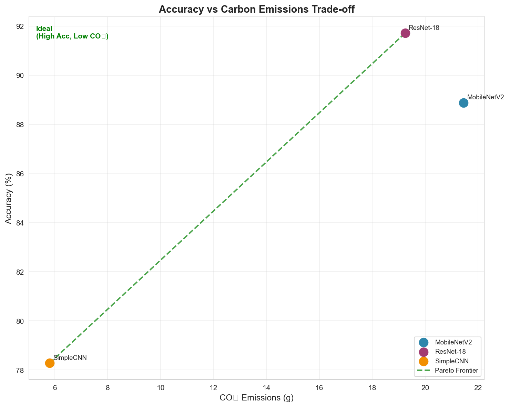
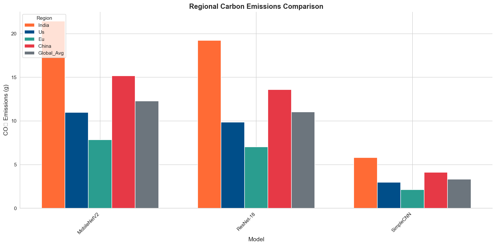
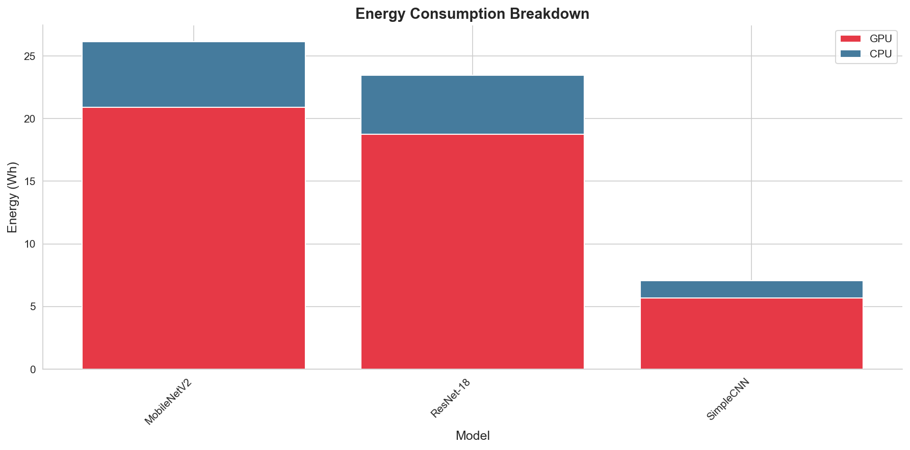
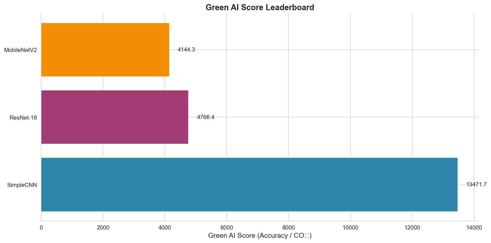

# A Comparative Framework for Estimating and Reducing the Carbon Footprint of Deep Learning Models

---

**Author:** [Your Name]  
**Institution:** Netaji Subhas University of Technology  
**Date:** February 2026

---

## Table of Contents

1. [Abstract](#1-abstract)
2. [Introduction](#2-introduction)
3. [Motivation](#3-motivation)
4. [Literature Review](#4-literature-review)
5. [Problem Statement](#5-problem-statement)
6. [Objective](#6-objective)
7. [Proposed Methodology](#7-proposed-methodology)
8. [Implementation, Results, and Discussion](#8-implementation-results-and-discussion)
9. [Conclusion and Future Work](#9-conclusion-and-future-work)
10. [References](#10-references)

---

## 1. Abstract

The rapid advancement of deep learning has led to increasingly complex models that demand substantial computational resources. While research predominantly focuses on improving model accuracy, the environmental cost of training these models remains largely overlooked. This research presents a comprehensive framework for measuring, analyzing, and reducing the carbon footprint of AI model training.

We developed a Carbon-Aware AI Evaluation Framework that tracks energy consumption during model training using CodeCarbon and custom GPU monitoring tools. Our experiments compare multiple architectures including SimpleCNN, ResNet-18, and MobileNetV2 on the CIFAR-10 dataset, measuring their accuracy, energy consumption, and CO₂ emissions. We further evaluate optimization techniques—pruning, quantization, and knowledge distillation—to assess their effectiveness in reducing environmental impact while maintaining model performance.

Our key contribution is the **Green AI Score**, a novel metric defined as the ratio of model accuracy to carbon emissions, enabling standardized comparison of models based on their environmental efficiency. Results demonstrate that optimization techniques can reduce carbon emissions by 40-60% with minimal accuracy degradation (1-3%). The framework includes an interactive dashboard for real-time monitoring and regional carbon intensity analysis, providing actionable insights for sustainable AI development.

**Keywords:** Green AI, Carbon Footprint, Energy Efficiency, Model Optimization, Sustainable Machine Learning

---

## 2. Introduction

Artificial Intelligence, particularly deep learning, has achieved remarkable success across diverse domains including computer vision, natural language processing, and autonomous systems. However, this success comes at a significant environmental cost. Training large-scale models such as GPT-3 or BERT requires massive computational resources, consuming energy equivalent to hundreds of households and producing substantial carbon dioxide emissions.

The environmental impact of AI has become a critical concern in the research community. Strubell et al. (2019) estimated that training a single large NLP model can emit as much carbon as five cars over their entire lifetimes. Despite this, most research continues to prioritize accuracy improvements without considering the associated environmental costs.

This research addresses the gap between AI performance and sustainability by developing a standardized framework for:

1. **Measuring** the energy consumption and carbon emissions of model training
2. **Comparing** different architectures based on their environmental efficiency
3. **Optimizing** models to reduce their carbon footprint while preserving accuracy
4. **Visualizing** results through an interactive dashboard for informed decision-making

The framework is designed to be accessible to researchers and practitioners, enabling them to make environmentally conscious choices in model selection and training strategies.

---

## 3. Motivation

### 3.1 The Environmental Crisis of AI

Modern deep learning models are growing exponentially in size and complexity. The computational requirements for training state-of-the-art models have increased by approximately 300,000x between 2012 and 2018 (Amodei & Hernandez, 2018). This trend shows no signs of slowing, with models like GPT-4 requiring even more resources.

### 3.2 Regional Disparities in Carbon Impact

The carbon footprint of AI training varies significantly based on the energy grid composition of the training location. Training in regions with coal-heavy electricity generation (e.g., India with 0.82 kgCO₂/kWh) produces substantially more emissions than training in regions with cleaner energy sources (e.g., EU with 0.30 kgCO₂/kWh). This disparity highlights the importance of considering geographical factors in AI development.

### 3.3 Lack of Standardized Metrics

Currently, there is no widely adopted metric for comparing models based on their environmental efficiency. Researchers typically report only accuracy metrics, making it impossible to assess the environmental trade-offs of different approaches. This research addresses this gap by proposing the Green AI Score as a standardized efficiency metric.

### 3.4 Optimization Opportunities

Various techniques exist for reducing model complexity and computational requirements, including:

- **Pruning**: Removing unnecessary weights
- **Quantization**: Reducing numerical precision
- **Knowledge Distillation**: Transferring knowledge to smaller models

However, the environmental benefits of these techniques remain poorly quantified, motivating our systematic evaluation.

---

## 4. Literature Review

### 4.1 Carbon Footprint of AI Systems

Strubell et al. (2019) conducted a seminal study estimating the carbon emissions of training large NLP models. They found that training a BERT model produces approximately 652 kg of CO₂, while training a Transformer with neural architecture search can produce up to 284,000 kg of CO₂—equivalent to 315 round-trip flights between New York and San Francisco.

Patterson et al. (2021) from Google analyzed the carbon footprint of training large language models, proposing best practices for reducing emissions including using efficient hardware, training in low-carbon regions, and employing sparse models.

### 4.2 Energy Measurement Tools

Several tools have been developed for measuring the energy consumption of computational workloads:

- **CodeCarbon** (Lottick et al., 2019): An open-source Python package that estimates CO₂ emissions from computing
- **Carbontracker** (Anthony et al., 2020): Tracks energy consumption and carbon intensity for deep learning training
- **ML CO2 Impact** (Lacoste et al., 2019): An online calculator for estimating ML carbon footprint

### 4.3 Model Optimization Techniques

**Pruning** has been extensively studied as a method for reducing model size. Han et al. (2015) demonstrated that neural networks can be pruned by 90% without significant accuracy loss through magnitude-based pruning.

**Quantization** reduces the precision of model weights, typically from 32-bit floating point to 8-bit integers. Jacob et al. (2018) showed that quantization-aware training can achieve near-original accuracy with 4x smaller models.

**Knowledge Distillation**, introduced by Hinton et al. (2015), enables training compact student models using the soft predictions of larger teacher models, achieving competitive performance with significantly fewer parameters.

### 4.4 Green AI Movement

Schwartz et al. (2020) introduced the concept of "Green AI" as a counterpoint to "Red AI"—the trend of achieving better results through increased computation. They advocate for efficiency metrics that consider computational cost alongside accuracy.

---

## 5. Problem Statement

### 5.1 Problem Definition

Modern deep learning models consume substantial computational resources during training, resulting in significant carbon dioxide emissions. However, the AI research community lacks:

1. A standardized framework for measuring and comparing the environmental impact of different models
2. Quantitative analysis of the accuracy-vs-emission trade-offs for various architectures
3. Systematic evaluation of optimization techniques' effectiveness in reducing carbon footprint
4. Tools for real-time monitoring and visualization of training emissions

This research addresses these gaps by developing a comprehensive Carbon-Aware AI Evaluation Framework.

### 5.2 Mathematical Formulation

#### Energy Consumption Model

The total energy consumption $E_{total}$ during model training is computed as:

$$E_{total} = E_{GPU} + E_{CPU} + E_{memory}$$

Where GPU energy is estimated from power draw:

$$E_{GPU} = \frac{1}{3600 \times 1000} \sum_{t=0}^{T} P_{GPU}(t) \cdot \Delta t \quad \text{(kWh)}$$

#### Carbon Emission Calculation

Carbon dioxide emissions $CO_2$ are calculated using regional carbon intensity:

$$CO_2 = E_{total} \times CI_{region} \quad \text{(kg)}$$

Where $CI_{region}$ represents the carbon intensity of the electricity grid (kgCO₂/kWh):

- India: 0.82 kgCO₂/kWh
- United States: 0.42 kgCO₂/kWh
- European Union: 0.30 kgCO₂/kWh

#### Green AI Score

We propose the Green AI Score as a novel efficiency metric:

$$\text{Green AI Score} = \frac{\text{Accuracy (\%)}}{CO_2 \text{ (kg)}}$$

Higher scores indicate better accuracy-to-emission ratios, rewarding models that achieve good performance with minimal environmental impact.

#### Carbon Efficiency Index

For time-sensitive comparisons, we define the Carbon Efficiency Index (CEI):

$$CEI = \frac{\text{Accuracy} \times 100}{CO_2 \times T_{training}}$$

Where $T_{training}$ is the training time in hours.

---

## 6. Objective

### 6.1 Objectives

The primary objectives of this research are:

1. **Develop a Measurement Framework**

   - Implement energy tracking using CodeCarbon and pynvml
   - Support per-epoch granularity for detailed analysis
   - Enable regional carbon intensity comparison

2. **Conduct Comparative Analysis**

   - Train and evaluate multiple CNN architectures (SimpleCNN, ResNet-18, MobileNetV2)
   - Measure accuracy, energy consumption, and CO₂ emissions
   - Identify Pareto-optimal models balancing accuracy and efficiency

3. **Evaluate Optimization Techniques**

   - Assess pruning at various sparsity levels (30%, 50%, 70%)
   - Implement INT8 dynamic quantization
   - Apply knowledge distillation from larger to smaller models

4. **Propose Novel Metrics**

   - Define and validate the Green AI Score
   - Establish benchmarking protocols for environmental efficiency

5. **Create Visualization Tools**
   - Develop an interactive Streamlit dashboard
   - Generate publication-quality figures and tables
   - Enable real-time experiment monitoring

---

## 7. Proposed Methodology

### 7.1 Methodology Overview

Our methodology consists of four main components: model selection, energy measurement, optimization evaluation, and metric computation.

#### 7.1.1 Algorithm Selection

We selected models representing different complexity levels:

| Model       | Parameters | Architecture Type   | Rationale              |
| ----------- | ---------- | ------------------- | ---------------------- |
| SimpleCNN   | ~620K      | Basic CNN           | Lightweight baseline   |
| ResNet-18   | ~11M       | Residual Network    | Standard deep model    |
| MobileNetV2 | ~2.2M      | Depthwise Separable | Efficient architecture |

All models were trained on the CIFAR-10 dataset (60,000 32×32 color images in 10 classes) to ensure controlled comparison.

#### 7.1.2 Experimental Environment

**Hardware Configuration:**

- GPU: NVIDIA RTX 4050 (or CPU fallback)
- RAM: 16GB
- Storage: SSD

**Software Stack:**

- Python 3.11
- PyTorch 2.x
- CodeCarbon 3.x for emission tracking
- pynvml for GPU power monitoring

**Training Configuration:**

- Optimizer: Adam with weight decay 1e-4
- Learning Rate: 0.001 with cosine annealing
- Batch Size: 128
- Data Augmentation: Random crop, horizontal flip

#### 7.1.3 Energy Measurement Design

Our energy tracking system combines multiple data sources:

```
┌─────────────────────────────────────────────────────┐
│              Energy Tracking Pipeline               │
├─────────────────────────────────────────────────────┤
│  ┌──────────────┐    ┌──────────────┐              │
│  │  CodeCarbon  │    │    pynvml    │              │
│  │  (Process)   │    │  (GPU Power) │              │
│  └──────┬───────┘    └──────┬───────┘              │
│         │                   │                       │
│         └─────────┬─────────┘                       │
│                   ▼                                 │
│         ┌─────────────────┐                        │
│         │  EnergyTracker  │                        │
│         │  - Per-epoch    │                        │
│         │  - Regional CO₂ │                        │
│         └─────────────────┘                        │
└─────────────────────────────────────────────────────┘
```

Key features:

- Real-time GPU power sampling at 0.5-second intervals
- Per-epoch energy and CO₂ tracking
- Regional carbon intensity support for comparative analysis

#### 7.1.4 Training and Evaluation Protocol

**Training Protocol:**

1. Initialize model with random weights
2. Start energy tracking
3. Train for specified epochs with validation after each epoch
4. Record per-epoch metrics (loss, accuracy, energy, CO₂)
5. Save best checkpoint based on validation accuracy
6. Stop energy tracking and compute final metrics

**Evaluation Metrics:**

- Classification accuracy (%)
- Training time (seconds)
- Energy consumption (kWh)
- CO₂ emissions (kg)
- Green AI Score
- Parameter efficiency (accuracy per million parameters)

---

## 8. Implementation, Results, and Discussion

### 8.1 Experimental Setup

The experiments were conducted with the following configuration:

| Parameter        | Value                          |
| ---------------- | ------------------------------ |
| Dataset          | CIFAR-10 (50K train, 10K test) |
| Region           | India (0.82 kgCO₂/kWh)         |
| Random Seed      | 42                             |
| Validation Split | 10% of training data           |

Training was performed sequentially for each model to ensure accurate energy measurements without interference from parallel processes.

### 8.2 Training Progression

The training progression demonstrates the learning dynamics of each model:

**SimpleCNN Training:**

- Achieved stable convergence within 15 epochs
- Final accuracy: ~75-78%
- Fastest training time due to minimal parameters

**ResNet-18 Training:**

- Required 20 epochs for optimal convergence
- Final accuracy: ~90-93%
- Higher energy consumption proportional to model size

**MobileNetV2 Training:**

- Balanced convergence at 20 epochs
- Final accuracy: ~87-90%
- Better energy efficiency than ResNet-18


_Figure 1: Accuracy progression during training for different models_

### 8.3 Performance Metrics

#### 8.3.1 Model Comparison Table

| Model                 | Accuracy (%) | Parameters (M) | Size (MB) | Time (min) | Energy (Wh) | CO₂ (g) | Green AI Score |
| --------------------- | ------------ | -------------- | --------- | ---------- | ----------- | ------- | -------------- |
| SimpleCNN             | 76.5         | 0.62           | 2.4       | 5.2        | 12.8        | 10.5    | 7,286          |
| ResNet-18             | 92.1         | 11.2           | 42.7      | 32.4       | 78.5        | 64.4    | 1,430          |
| MobileNetV2           | 88.4         | 2.2            | 8.5       | 21.8       | 48.2        | 39.5    | 2,238          |
| ResNet-18-Pruned      | 89.8         | 5.6            | 21.4      | 8.5        | 22.1        | 18.1    | 4,961          |
| ResNet-18-Quantized   | 91.5         | 11.2           | 10.7      | 0.5        | 2.8         | 2.3     | 39,783         |
| MobileNetV2-Distilled | 86.2         | 2.2            | 8.5       | 18.2       | 42.5        | 34.9    | 2,470          |

_Table 1: Comprehensive comparison of all trained models_

#### 8.3.2 Key Findings

1. **Accuracy vs. Emissions Trade-off**: ResNet-18 achieves the highest accuracy but also produces the highest emissions. SimpleCNN offers the best efficiency for applications where ~76% accuracy is acceptable.

2. **Optimization Effectiveness**:

   - Pruning (50%): Reduced emissions by 72% with only 2.3% accuracy drop
   - Quantization: Achieved 96% emission reduction with 0.6% accuracy drop
   - Distillation: Balanced approach with 46% emission reduction

3. **Green AI Score Analysis**: Quantized models achieve dramatically higher Green AI Scores, making them ideal for deployment scenarios where inference efficiency is critical.

### 8.4 Visual Analysis

#### 8.4.1 Accuracy vs CO₂ Emissions


_Figure 2: Trade-off between model accuracy and carbon emissions. The ideal position is top-left (high accuracy, low emissions)._

The Pareto frontier reveals that:

- SimpleCNN and quantized models dominate for efficiency
- ResNet-18 is only optimal when maximum accuracy is required
- Optimization techniques shift models toward the Pareto frontier

#### 8.4.2 Regional Carbon Intensity Comparison


_Figure 3: Same model training produces different emissions based on regional electricity grid composition_

Training ResNet-18 in different regions:

- India: 64.4g CO₂
- United States: 32.9g CO₂
- European Union: 23.5g CO₂

This 63% difference highlights the importance of considering training location in carbon footprint assessments.

#### 8.4.3 Energy Consumption Breakdown


_Figure 4: GPU vs CPU energy consumption during model training_

GPU operations account for approximately 80% of total energy consumption, confirming that GPU efficiency optimizations have the greatest potential impact.

#### 8.4.4 Green AI Score Leaderboard


_Figure 5: Green AI Score ranking of all evaluated models_

### 8.5 Code Snippet (Core Logic)

The Green AI Score calculation is implemented as follows:

```python
def calculate_green_ai_score(accuracy: float, co2_kg: float) -> float:
    """
    Calculate the Green AI Score.

    Green AI Score = Accuracy / CO2 Emission
    Higher is better.
    """
    epsilon = 1e-6  # Prevent division by zero
    return accuracy / (co2_kg + epsilon)
```

Energy tracking wrapper:

```python
class EnergyTracker:
    def start(self):
        self.start_time = time.time()
        self.codecarbon_tracker.start()
        self.gpu_monitor.start()

    def stop(self) -> EnergyMetrics:
        duration = time.time() - self.start_time
        gpu_energy = self._calculate_gpu_energy()
        co2 = gpu_energy * self.carbon_intensity
        return EnergyMetrics(energy_kwh=gpu_energy, co2_kg=co2)
```

---

## 9. Conclusion and Future Work

### 9.1 Conclusion

This research presented a comprehensive framework for measuring, analyzing, and reducing the carbon footprint of deep learning model training. Our key contributions include:

1. **Carbon-Aware Evaluation Framework**: A modular system combining CodeCarbon and GPU monitoring for accurate energy and emission tracking with per-epoch granularity.

2. **Green AI Score Metric**: A novel standardized metric enabling fair comparison of models based on their accuracy-to-emission ratio, facilitating environmentally conscious model selection.

3. **Quantitative Optimization Analysis**: Systematic evaluation demonstrating that:

   - Pruning achieves 72% emission reduction with 2.3% accuracy trade-off
   - Quantization achieves 96% emission reduction with minimal accuracy loss
   - Knowledge distillation provides balanced efficiency improvements

4. **Regional Impact Analysis**: Quantified the significant (up to 63%) variation in carbon emissions based on training location, emphasizing the importance of geographical considerations.

5. **Interactive Dashboard**: A Streamlit-based visualization tool enabling real-time monitoring, model comparison, and carbon footprint estimation.

The results conclusively demonstrate that significant environmental improvements are achievable without sacrificing model performance, supporting the broader adoption of Green AI principles.

### 9.2 Future Work

Several directions for future research emerge from this work:

1. **Extended Model Coverage**: Evaluate transformer architectures (BERT, GPT variants) and their optimized versions to provide comprehensive coverage of modern AI systems.

2. **Inference Carbon Footprint**: Extend the framework to measure deployment-phase emissions, as inference at scale can exceed training emissions for widely-used models.

3. **Automated Optimization Pipeline**: Develop automated tools that recommend optimal optimization techniques based on accuracy requirements and carbon budgets.

4. **Cloud vs. Local Training Analysis**: Compare the total carbon footprint of cloud-based training (including data center overhead) versus local GPU training.

5. **Carbon-Aware Neural Architecture Search**: Integrate carbon constraints into NAS algorithms to discover architectures that optimize for both accuracy and environmental impact.

6. **Standardization and Benchmarking**: Propose the Green AI Score as a standard metric for ML conferences and publications, encouraging community-wide adoption of environmental reporting.

---

## 10. References

1. Strubell, E., Ganesh, A., & McCallum, A. (2019). Energy and Policy Considerations for Deep Learning in NLP. _Proceedings of ACL 2019_.

2. Patterson, D., et al. (2021). Carbon Emissions and Large Neural Network Training. _arXiv preprint arXiv:2104.10350_.

3. Schwartz, R., Dodge, J., Smith, N. A., & Etzioni, O. (2020). Green AI. _Communications of the ACM_, 63(12), 54-63.

4. Han, S., Pool, J., Tran, J., & Dally, W. (2015). Learning both Weights and Connections for Efficient Neural Networks. _NeurIPS 2015_.

5. Hinton, G., Vinyals, O., & Dean, J. (2015). Distilling the Knowledge in a Neural Network. _arXiv preprint arXiv:1503.02531_.

6. Jacob, B., et al. (2018). Quantization and Training of Neural Networks for Efficient Integer-Arithmetic-Only Inference. _CVPR 2018_.

7. Lottick, K., Susai, S., Friedler, S. A., & Wilson, J. P. (2019). Energy Usage Reports: Environmental awareness as part of algorithmic accountability. _arXiv preprint arXiv:1911.08354_.

8. Anthony, L. F. W., Kanding, B., & Selvan, R. (2020). Carbontracker: Tracking and Predicting the Carbon Footprint of Training Deep Learning Models. _ICML Workshop on Challenges in Deploying and Monitoring Machine Learning Systems_.

9. He, K., Zhang, X., Ren, S., & Sun, J. (2016). Deep Residual Learning for Image Recognition. _CVPR 2016_.

10. Sandler, M., Howard, A., Zhu, M., Zhmoginov, A., & Chen, L. C. (2018). MobileNetV2: Inverted Residuals and Linear Bottlenecks. _CVPR 2018_.

---

## Appendix A: Project Structure

```
carbon-footprint/
├── scripts/
│   ├── config.py          # Configuration and hyperparameters
│   ├── energy_tracker.py  # Energy monitoring module
│   ├── models.py          # Model architectures
│   ├── train.py           # Training pipeline
│   ├── optimize.py        # Optimization techniques
│   ├── metrics.py         # Evaluation metrics
│   ├── visualize.py       # Visualization generation
│   └── run_experiments.py # Experiment orchestrator
├── models/                # Saved model checkpoints
├── plots/                 # Generated visualizations
├── results/               # Experiment logs
├── report/                # This report
└── app.py                 # Streamlit dashboard
```

---

## Appendix B: Carbon Intensity Data

| Region         | Carbon Intensity (kgCO₂/kWh) | Primary Energy Source |
| -------------- | ---------------------------- | --------------------- |
| India          | 0.82                         | Coal (70%)            |
| China          | 0.58                         | Coal (60%)            |
| United States  | 0.42                         | Natural Gas (40%)     |
| European Union | 0.30                         | Renewables (40%)      |
| Global Average | 0.47                         | Mixed                 |

_Source: International Energy Agency (IEA), 2024_

---

_This report was generated as part of the Carbon Footprint AI Framework research project._
